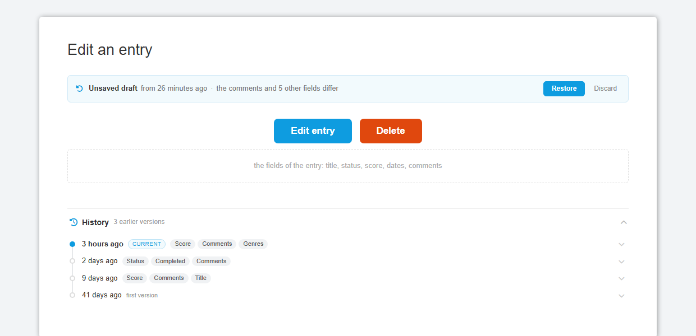
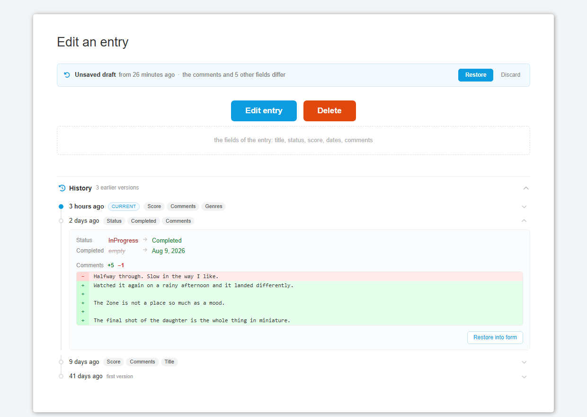
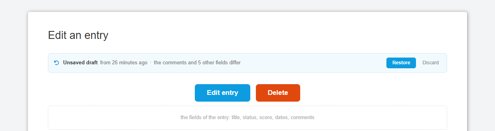

# Memo

## Workflow

**1. Locally.** Running the website locally is recommended to test changes before pushing commits.

```bash
# install the dependencies
npm install

# you will need to run these once
npx netlify login # requires being logged into netlify, ask for credentials
npx netlify link # when it asks what linking method to use, choose github

# The app will then be available locally for building with
 npx netlify dev

# Deprecated alternative
npm run dev
```

If you use `npx netlify dev` your serverless functions will also be available at:

```
GET http://localhost:8888/.netlify/functions/<function_file_name_without_extension>
```

**2. Deploying.** `main` is the only long-lived branch. Netlify publishes nil.moe from `main`
automatically on every push, so there is no separate staging or production branch and no manual
promotion step.

## Web Development Stack

We use:

- [Netlify](https://www.netlify.com) for web hosting and deployment
- [Node and NPM](https://nodejs.org) for runtime environment and package management
- [Eleventy](https://11ty.io) for static site generation
- A tiny inline JS pipeline with a [component-based architecture](https://medium.com/@dan.shapiro1210/understanding-component-based-architecture-3ff48ec0c238)
- Serverless (FaaS) development pipeline with [Netlify Dev](https://www.netlify.com/products/dev) and [Netlify Functions](https://www.netlify.com/products/functions)

**Credentials.**
This project is deployed via netlify with the account `{ask}` (ask me for password).

External API keys are set in [Netlify](https://app.netlify.com/sites/td-memo/settings/deploys#environment)
environment variables. They are also avaiable in production inside
`process.env`.

You might need to run `npx netlify login` inside the project.

**Netlify plugins.**

- Identity. Managed at https://app.netlify.com/sites/td-memo/identity
- FaunaDB. Managed at https://dashboard.fauna.com by logging in with netlify account integration.

**DB**

We currently use mongoDB, logged into via the MONGODB_URL

Saving an entry writes the entry and its long note in one transaction, so a
failure part-way leaves neither rather than one of them. Transactions need a
replica set, which Atlas is — and Atlas is what production and a local
`netlify dev` both talk to, since `MONGODB_URL` points at the same place from
either. Pointed at a standalone `mongod` instead, `db.withTransaction` warns
once and runs the writes in order without a transaction, which is what the
code did before it existed: the save still works, but a failure between the
two writes can leave the note stale beside a freshly saved entry.

**Backups.** `src/db_maintenance/backup_database.js` takes a timestamped
snapshot of every collection and prunes old ones to a retention policy, so
there is a history of backups rather than one overwritten dump;
`restore_backup.js` puts a snapshot (or one collection of it) back. See
[src/db_maintenance/README.md](src/db_maintenance/README.md).

**Reading a list without a browser.** The lists are drawn client-side, so
fetching `https://nil.moe/films/nil` and reading the HTML gets you an empty
`<div id="site">` — no titles, no scores, no notes. That is a problem for
anything that isn't a browser, a language model above all. The export
endpoint is the same lists as data:

```
GET /api/export/:type/:username      # one list: films, tv, games or books
GET /api/export/:username            # all four at once
?format=md                           # Markdown instead of JSON
?limit=200                           # the N most recently updated, per list
```

Every entry comes with the work's metadata (with the user's overrides
applied, as the page shows it), the score, the dates and the long note.
`workRef`, `userId`, `apiRefs` and the raw override object stay out of it;
durations are in minutes and dates are `YYYY-MM-DD`, so nothing has to be
decoded. It is public, exposing exactly what the rendered page already does —
drafts and edit history stay owner-only.

**A Netlify function may return 6 MB.** All four of `nil`'s lists are already
over 4 MB and the notes are what grow, so the all-in-one url is the one that
will hit the ceiling first. Over 5 MB it answers `413` naming the per-type
urls and `?limit=`, rather than letting Netlify return a 502 with nothing in
it. One list at a time is the shape that keeps working.

The `<noscript>` block in `layouts/base.njk` is the only part of a page that
is in its source, and it points at these urls, so a reader that fetches
`/films/nil` and finds nothing is told where to look. `_redirects` maps
`/api/*` onto `/.netlify/functions/*`, which is what makes every url in this
README real rather than aspirational.

**Entry history and drafts.** Saving an entry stores the version it replaced
in the `entryRevisions` collection, and the edit form autosaves what is in it
to the same collection while it is open. The edit modal grows a *History*
section listing every version, what it changed, a diff of the comments, and a
"Restore into form" button; a leftover draft is offered when the form opens.
Both are owner-only, and a restore is an ordinary edit — nothing is written
until the user presses the button. The API is
`GET /api/revisions/:type/:dbRef` and
`GET|PUT|DELETE /api/revisions/:type/:dbRef/draft`.

At most 50 versions are kept per entry, and every lookup is by `entryRef`, so
the collection needs an index on it — `findDraft` runs on every autosave,
every 2.5 seconds while the form is open, against 50 full snapshots per entry.
`src/db_maintenance/scripts/ensure_indexes.js` creates that index along with
every other one the site's queries need, and is safe to re-run.

The history, collapsed — one row per save, with the fields it touched:



A version opened, with the old and new value of each field and a diff of the
comments:



The draft, offered when the form opens on an entry with unsaved changes:



**Error handling.**
Error handling is done using `neverthrow`, which is similar to
Rust Result or FP Either. Learn more about its API at:
https://github.com/supermacro/neverthrow

**Current rate limits.**

- TV/Series

  - TMDB API: unlimited

- Google Books API

  - Potentially 1000/day with key, with easy free application for 100k (warning: old information)
    - Right now we're not using an API key. If you want to try, [then sign up for one](https://cloud.google.com/docs/authentication/api-keys?visit_id=637791358916015831-391700742&rd=1) and add GOOGLE_API_KEY to the Netlify environment variables. The code will automatically pick it up.

- Games
  - IGDB: 4 reqs/sec (currently fetching details takes 2 requests due to getting company names)
  - HLTB scraping: unknown but at least near-unlimited
